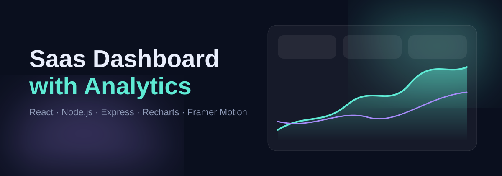

<p align="center"></p>

# Saas Dashboard with Analytics

A modern analytics dashboard: React front end, Node.js + Express API, interactive charts, animated page transitions and a light/dark theme.

## Screenshots
Run the app, then save your captures in `screenshots/` using these names.

| Overview | Customers | Light mode |
|---|---|---|
|  |  |  |

Also add `login.png` and `register.png` for the auth screens.

## Features
- KPI cards with count-up numbers and change vs the earlier half of the period
- Revenue and active-user chart (area + line), acquisition donut, MRR by plan bar chart
- 7 / 30 / 90 day range switcher with a sliding pill; charts update from the API
- Customers table with live search across name, email, plan and status
- Blur-fade page transitions, staggered card entrances, animated aurora background
- Light and dark themes (remembered), responsive layout, reduced-motion support
- Register and log in: bcrypt-hashed passwords, JWT sessions, protected routes, password strength meter, profile settings, toast notifications

## Tech
React 18, Vite, React Router, Recharts, Framer Motion, Node.js, Express.

## Getting started
Requires Node.js 18.11 or newer.
```bash
npm run setup     # installs root, server and client dependencies
npm run dev       # API on :4000, app on http://localhost:5173
```
Production: `npm run build && npm start` serves the built app and API on http://localhost:4000.

## API
| Route (all except register and login need `Authorization: Bearer <token>`) | Description |
|---|---|
| `POST /api/auth/register` `POST /api/auth/login` | Create an account or log in; returns a JWT |
| `GET /api/auth/me` `PUT /api/auth/profile` | Current user; update name and company |
| `GET /api/overview?range=7\|30\|90` | KPIs, time series, channels, plans, newest customers |
| `GET /api/customers?q=text` | Customers filtered by name, email, plan or status |

Data is generated in `server/index.js` with a seeded generator, so it is stable between runs. Replace it with a database (PostgreSQL, MongoDB) to go live.

## Structure
```
server/index.js            Express API
client/src/App.jsx         Layout, theme, page transitions
client/src/pages/          Overview.jsx, Customers.jsx
client/src/ui.jsx          CountUp, chart tooltip
client/src/styles.css      Design tokens and styles
assets/                    Logo and banner
```
## Roadmap
Real database (users live in `server/data/users.json` for now), password reset, login rate limiting, CSV export, date-range picker.

**Before deploying:** set a strong `JWT_SECRET` environment variable.
